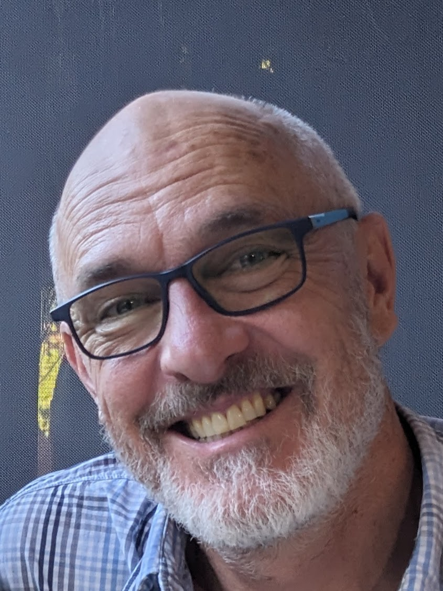

# About me

{ width=25% }

I grew up in Sydney, studied pure mathematics and computer science at the
Australian National University (ANU), finishing with a doctorate in applied
mathematics / soft-matter physics.

I had a 25 year academic career with positions with the CNRS in France, Sydney,
Macquarie, ANU and finally the University of the Highlands and Islands in
Scotland, where I was leader of the computing degree.

Along the way I studied creative writing and then trained as a psychotherapist
and counsellor. I practiced psychotherapy part-time for three years.

In 2017 I left academia and have worked since then as a software engineer
specialising in cryptography and most recently a product manager.

I live in the Findhorn eco-village / intentional community in the north of
Scotland.

My interests include bushwalking / hiking / randonnée, choral singing,  playing
the piano, reading Australian literature and non-formulaic science fiction,
visual art, philosophy & politics, psychotherapy, trauma & recovery, sexual
politics, men's work...
