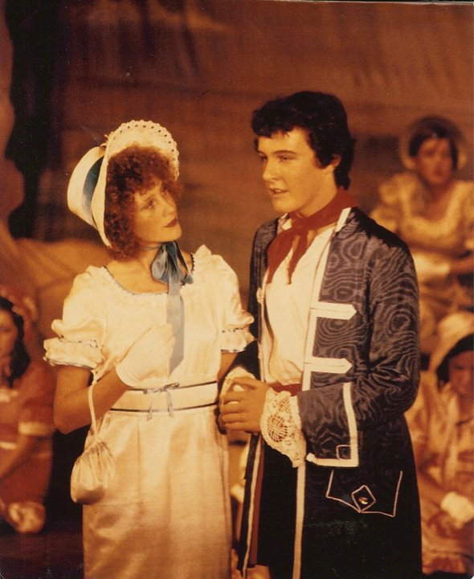
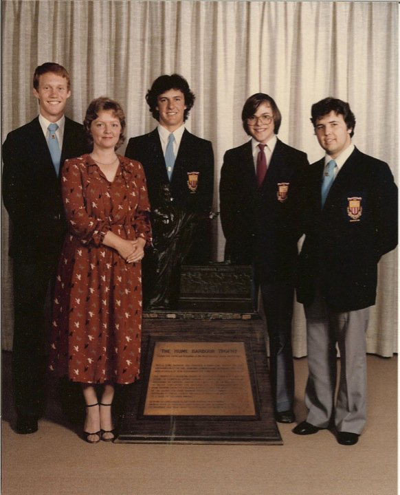
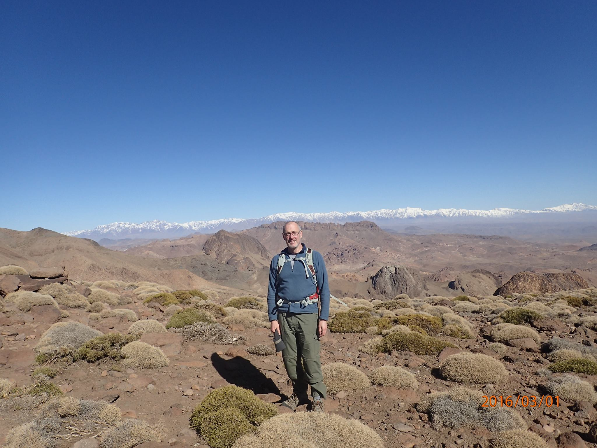

# About me

{ width=25% }

## Bio

I grew up in Sydney, where I went to [Middle Harbour Public School][middle harbour], [Neutral Bay
Public School][neutral bay] and [North Sydney Boys High School][nsbhs]. In 1969 my family spent a
year in Tübingen and London, and in 1975-76 a year in New Haven. I was in the school orchestra and
choir. I took part in several school musical coproductions with North Sydney Girls High, including
playing the role of Frederick in the Pirates of Penzance in 1979. I was in the school debating team
that won the state-wide Hume Barbour competition in 1980.

/// caption
_Pirates of Penzance, 1979_
///

/// caption
_North Sydney Boys High debating team, 1980_
///

I studied pure mathematics and computer science at the [Australian National University][anu] (ANU).
My doctorate was in [applied mathematics][anu applied maths] at the ANU, modelling the geometry of
self-assembled microstructure in surfactant systems. I was based at the ANU but also spent time in
Paris and Lund. I had postdoctoral fellowships in Bordeaux and ANU, and lectured in mathematics at
Sydney and Macquarie.

In 1998 I changed fields to computer science and software engineering. I had a tenured lectureship
in [computer science at ANU][anu dcs]. After moving to Scotland in 2010, I was leader of the
[computing degree][uhi computing degree] at the University of the Highlands and Islands in Scotland.

In 2003-4 I studied creative writing at the University of Canberra. In 2006-7 I trained as a
psychotherapist and counsellor at the Jansen-Newman Institute in Sydney. I practised psychotherapy
part-time in Canberra until the end of 2009.

In 2017 I left academia. I worked at [Quintessence Labs][qlabs] in Canberra and then at
[Cryptosense][cryptosense] in Paris. In 2022 Cryptosense was acquired by [SandboxAQ][sandbox], a
Google X (“the moonshot factory”) spinout.

In November 2023 I returned to Scotland, where I now live in the Findhorn eco-village intentional
community.

## Interests

I like bushwalking / hiking / randonnée, whether in mountains, forests or along coastlines. I have
done a few walks of a week or so: the Great Glen Way in Scotland, Djebel Siroua in Morocco, around
the Kaisergebirge in Austria, the Corfu trail. I'm interested in doing a longer walk some time,
maybe the Camino.

{ width=67% }
///caption
_Djebel Siroua, Morocco, March 2016_
///

Other interests include:

- Music: Choral singing, in particular of the baroque period. Between choirs right now.
  Also playing the piano: Bach, Beethoven, Schubert, Chopin, Mozart...

- Australian literature: Helen Garner, Tim Winton, Peter Carey...

- Non-formulaic science fiction: Ursula K. LeGuin, Doris Lessing, William Gibson, Margaret
  Atwood, Cory Doctorow, Neal Stephenson...

- Visual art: drawing, printmaking, mixed media, mathematical art...

- Personal growth, therapy, trauma, sexual politics, men's work.

- Politics, social change, science, the environment.

[anu]: https://www.anu.edu.au/
[sandbox]: https://www.sandboxaq.com/
[cryptosense]: https://cryptosense.com/
[qlabs]: https://www.quintessencelabs.com/
[uhi computing degree]: https://www.uhi.ac.uk/en/courses/bsc-hons-computing/
[anu dcs]: https://cecs.anu.edu.au/
[macquarie uni maths]: https://www.mq.edu.au/faculty-of-science-and-engineering/departments-and-schools/department-of-mathematics-and-statistics
[anu applied maths]: https://physics.anu.edu.au/appmaths/
[sydney uni maths]: https://www.sydney.edu.au/science/schools/school-of-mathematics-and-statistics.html
[cnrs crpp]: http://www.crpp-bordeaux.cnrs.fr
[middle harbour]: https://middleharb-p.schools.nsw.gov.au/
[neutral bay]: https://neutralbay-p.schools.nsw.gov.au/
[nsbhs]: https://northsydbo-h.schools.nsw.gov.au/
