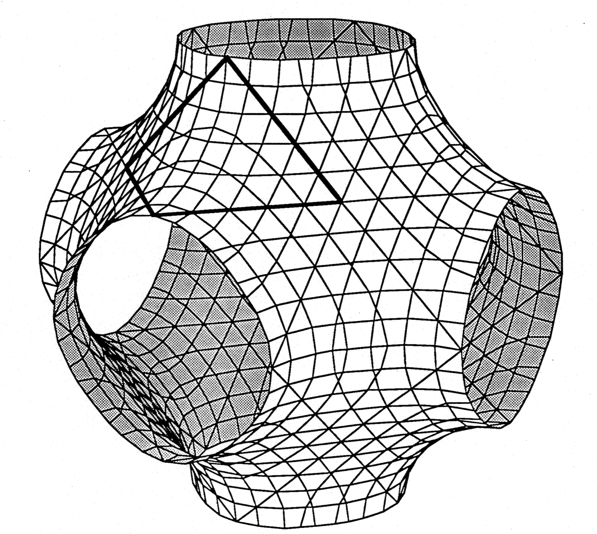
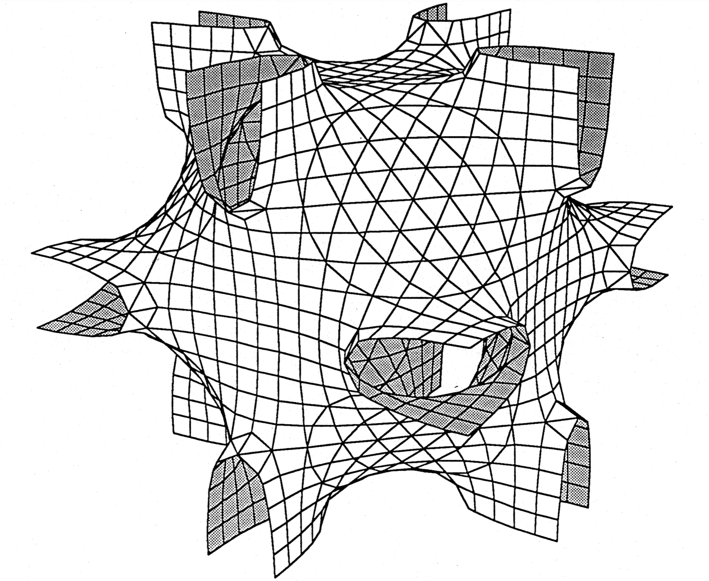
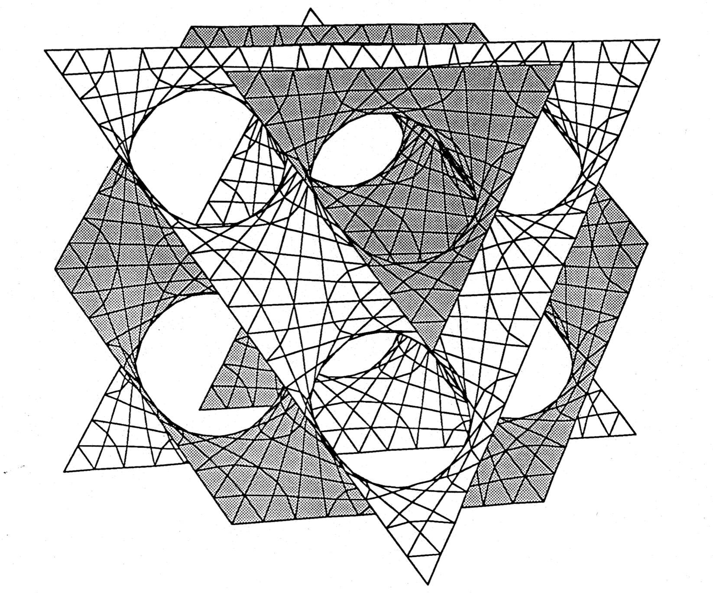
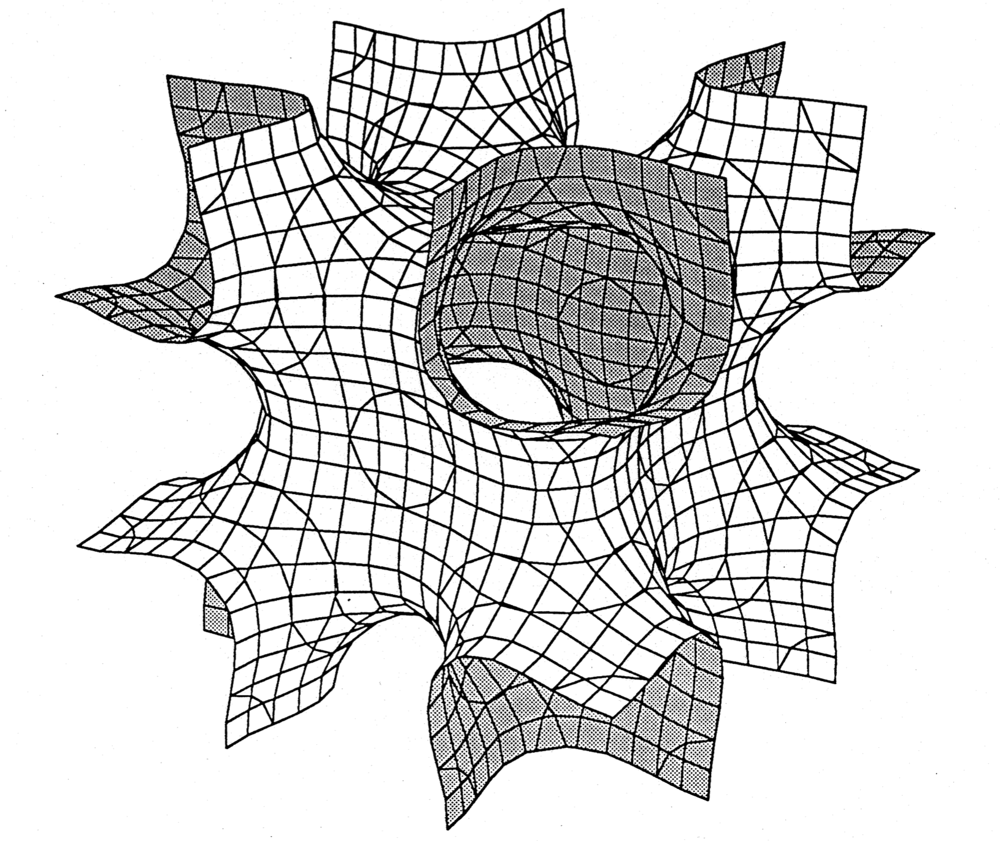
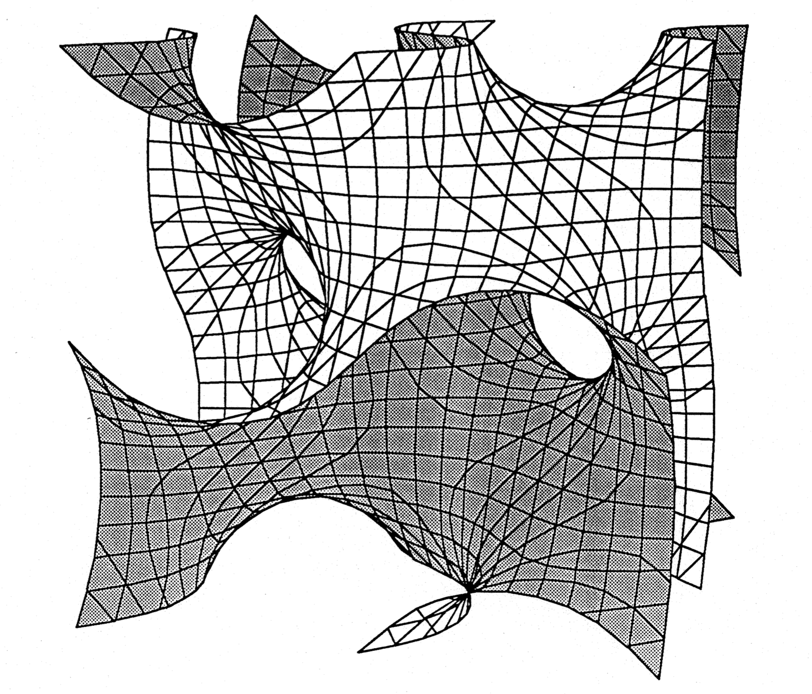

---
date:
  created: 2020-12-20
  updated: 2025-04-20

---

# Visualisation of periodic surfaces

Here are some images I generated while I was writing my [PhD thesis][thesis].
These are all the solutions of simple equations involving trig functions, but
are close to and share symmetry and topology with periodic minimal surfaces,
which are difficult to calculate and work with.

<!-- more -->

Images similar to these were presented in a talk I gave at the 1989 Australian
Mathematical Society's annual conference, and for which I won the B.H. Neumann
prize.

The equations are obtained by taking just the lowest order terms in the Fourier
expansion of the potential generated by a point charge distribution resembling
various crystal structures.

This is one repeating unit of the surface

$$
\cos X + \cos Y + \cos Z = 0.
$$

This is just the lowest order terms in the expansion of the potential for the
CsCl crystal, which has two interlocking simple cubic lattices. The resulting
surface closely resembles the Schwarz P surface, the best-known of the periodic
minimal surfaces.

By taking one additional term in the same expansion, we get the equation

$$
3 ( \cos X + \cos Y + \cos Z ) + 4 \cos X \cos Y \cos Z = 0
$$

and the resulting surface resembles the Neovius minimal surface. Charges with
the same sign are joined by tunnels leading to their second-nearest neighbours
rather than their nearest neighbours.

If we change the charge distribution to that for the NaTl crystal, which has two
interlocking diamond lattices, and again take only the lowest-order terms, we
get the equation

$$
\sin X \sin Y \sin Z +
\sin X \cos Y \cos Z +
\cos X \sin Y \cos Z +
\cos X \cos Y \sin Z = 0.
$$

which gives a surface closely resembling the Schwarz D surface.

By concocting an artificial charge distribution we can get something close to
Schoen's I-WP surface. In this case the lowest-order terms alone give a surface
that “pinches off” the tunnels, but adding in the second-order terms gives the
equation

$$
2 ( \cos X \cos Y + \cos Y \cos Z + \cos Z \cos X ) -
\cos 2X - \cos 2Y - \cos 2Z = 0
$$

and the resulting surface separates a body-centered lattice from the “wrapped
package” lattice.

Finally, with another imaginary charge distribution we're able to get the
equation

$$
\sin X \cos Y + \sin Y \cos Z + \sin Z \cos X = 0
$$

and the resulting surface closely resembles Schoen's Gyroid minimal surface.

These images were all generated by a Pascal program that divided the repeating
unit cube into $20 \times 20 \times 20$ smaller cubes. For each small cube, it
computed the function values at the 8 vertices, and if there were any sign
changes, approximated the positions of the zeros of the function along each edge
by linear interpolation, then joined these points to form a polygon that
approximates the part of the surface inside that little cube. This was done in
order from back to front so that closer polygons overwrote and obscured those
further away from the viewing point, thus avoiding the need for complex hidden
surface removal algorithms.

Each image took about an hour to produce on [Macintosh IIci][], a pretty
powerful desktop workstation back in 1989.

Update: The algorithm described above is called [marching cubes][]. It was first
published in 1987 in the ACM SIGGRAPH conference. I was totally unaware that
this existed or was considered worthy of publication. I invented it
independently in 1989 because I needed it, and thought nothing more of it. I
only realised it was a “thing” with a name, many years later.

[thesis]: https://openresearch-repository.anu.edu.au/handle/1885/49316
[Macintosh IIci]: https://en.wikipedia.org/wiki/Macintosh_IIci
[marching cubes]: https://en.wikipedia.org/wiki/Marching_cubes
