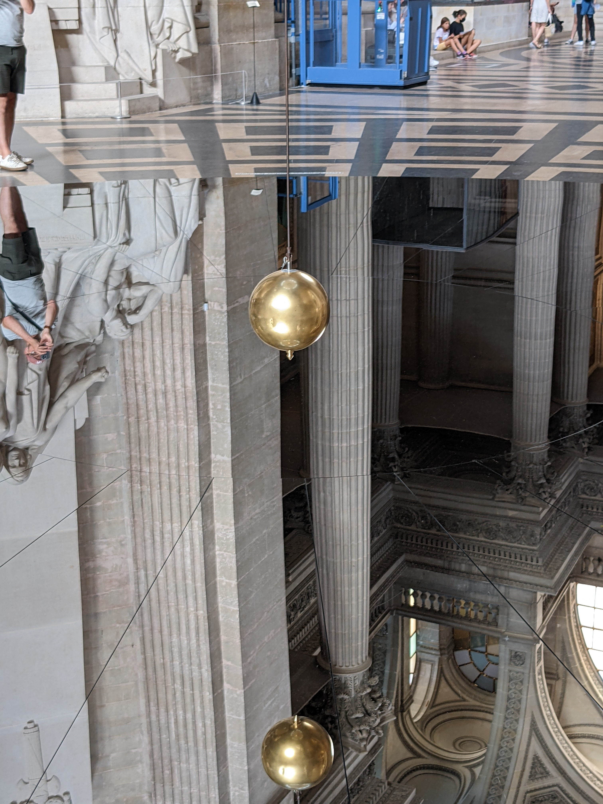

# Foucault's pendulum

I visited the Panthéon yesterday, and saw the original Foucault's pendulum.
Well, sort of. It's the same location, but it got taken down when the Panthéon
became a church again for a while, and was then restored, and then the wire
broke and they had to replace it. And at some point the original 28kg bob was
replaced with one almost twice as heavy. So it's a bit like the story about the
axe that's had three new handles and two new heads...

<!-- more -->

I'd recently seen [this fun YouTube video][youtube-lewin] of renowned physics
lecturer Walter Lewin's farewell lecture, in which among other things he swings
from a pendulum to confirm that changing the mass doesn't change the period. So
I thought I'd try timing the Panthéon pendulum's swings and see if I could get a
good value for the length of the wire...

I thought I'd time 10 swings, but this took longer than I'd imagined, and I got
distracted and nearly lost count. But in the end I measured approximately 2
minutes and 44 seconds. Guessing that my reaction time is probably good to about
plus or minus half a second, that gives $\newcommand{\metre}{\text{m}}
\newcommand{\second}{\text{s}}10T\approx 164\pm 0.5\thinspace\second$ and so $T
\approx 16.4 \pm 0.05 \thinspace\second$. The formula for the period $T$ is

$$
T = 2 \pi \sqrt{\frac L g}
$$

Inverting that gives

$$
L = g \left( \frac{T}{2\pi}\right)^2
$$

According to [Wikipedia][wikipedia-gravity], the gravitational acceleration in
Paris is $g \approx 9.809 \thinspace\metre\second^{-2}$. If that last
significant figure is indeed significant, then the relative error in this value
is a couple of orders of magnitude less than the error in my time measurement
and can safely be ignored. So

$$
L \approx \left( 9.809 \thinspace\metre\second^{-2} \right) \times \left(
\frac{16.4 \pm 0.05 \thinspace\second}{2\pi} \right)^2 \approx 66.8 \pm 0.4
\thinspace\metre
$$

The information panel in the Panthéon states that the length is 67 metres, so
we're within the error bars! Not too bad given that the formula is based on the
small-angle approximation and doesn't take any sort of friction or drag into
account.

There's a mirror on the floor, it looks amazing.

[youtube-lewin]: https://youtu.be/4a0FbQdH3dY
[wikipedia-gravity]:
    https://en.wikipedia.org/wiki/Gravity_of_Earth#Comparative_values_worldwide
