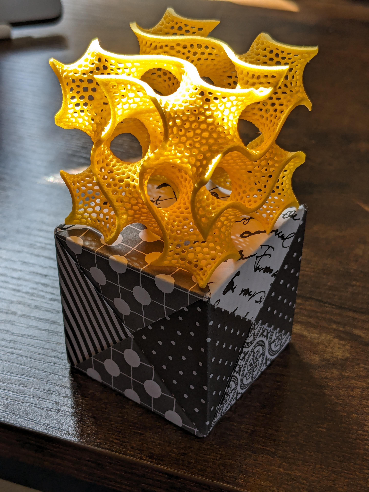

# Another periodic surface image

This is a follow-up to [Visualisation of periodic
surfaces](2020-12-20-visualisation-of-periodic-surfaces.md). A while ago I saw
this 3D printed Gyroid model advertised online and couldn't resist it. Design by
[Bathsheba Grossman](https://www.bathsheba.com/), printed on demand by
[Shapeways](https://www.shapeways.com/product/QNFAKNW9Z/gyroid).

<!-- more -->

It's been sitting on my desk for two years. A few days ago I somewhat randomly
made an origami cube and it turned out to be almost exactly the same size. They
were sitting on my desk and the sun came in through the window and hit them.

