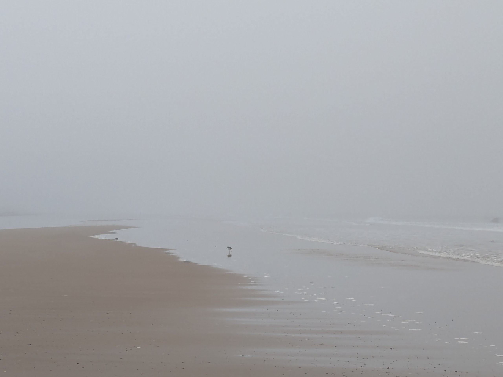

# Oystercatchers

_A sort of poem, with illustrations._

<!-- more -->

_Findhorn beach, Sunday 9th February 2025_

You ask for space.  
In fear and self-doubt, I head to the beach.  
I am lost, alone in the fog.  
There is no future  
Only _this_ moment, _here, now._  
Flat and grey.  
Sand, water, muffled sounds.  
I can't feel you, panic chokes my throat.  
_Breathe. Look closer._  
Pebbles, seaweed, broken shells. Relics.  
The empty echoing wreckage of a love abandoned, half-built.

{ width="50%" }

And then two oystercatchers, paired for life  
Working the water's edge alongside me  
For a little while.  
Long enough.

I am connected with life  
I am alive  
I am love  
Yes

{ width="67%" }
